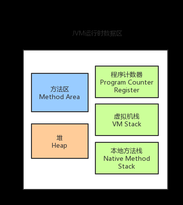
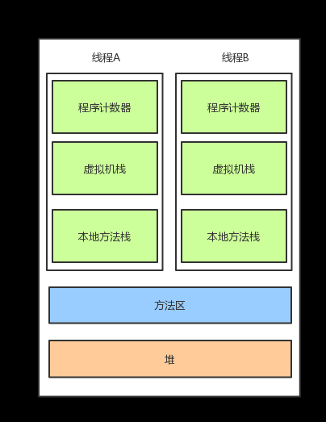

#Day01JVM基础必备篇
##(1)简述JDK，JRE和JVM之间的关系
    1.JDK:
        JDK(Java Development Kit),即Java开发工具包，是一个编写Java应用程序的开发环境。
        JDK是整个Java的核心，包括了JRE(Java运行环境)与一些Java开发工具(例如：jconsole、avac、java、javadoc、native2ascii、jar等）,JDK=JRE+Java开发工具（编译器、调试器等)。
    2.JVM:
        JVM即Java虚拟机，运行在操作系统之上，存在于内存中，与内存打交道。与硬件没有直接交互，是Java语言实现跨平台的核心，JVM主要负责运行Java编译器编译后的字节码文件，JVM在
        执行字节码时，会把字节码解释成具体平台上的机器码执行，JVM自己无法执行，必须要联合JRE中的Java基础*核心类库才能使用。
        JVM是一种抽象，虚拟出来的计算机，和实际的计算机一样，它具有指令集并使用不同的存储区域，他负责执行指令，还要管理数据，内存和寄存器，类的文件格式，栈，垃圾回收堆，存储区等。
    3.JRE:
        JRE(Java Runtime Environment)，即Java运行环境,支持Java程序运行的标准环境，包括了JVM，以及Java基础&核心类库，也包含JVM运行时需要的类库
    4.JDK&JRE&JVM总结：
        JRE=JVM+Java基础&核心类库
        JDK=JRE+Java开发工具(编译器，调试器等)
        JRE是个运行环境，JDK是个开发环境，编写Java程序的时候需要JDK，而运行Java程序的时候就需要JRE。因为JDK里面已经包含了JRE，因此只要安装了JDK，就可以开发Java程序，也可以正常运行Java程序。
##(2)类加载机制的作用和过程（1.防止Java的核心类被篡改 2.防止重复加载相同的类）
    类从加载到虚拟机内存中开始，到卸载出内存为止，它的生命周期包括：
        加载-----链接（验证-----准备-----解析）-----初始化-----使用-----卸载
    双亲委派机制： 
        如果一个类加载器收到了类加载的请求，它首先不会自己去加载该类，而是把这个请求委派给父类加载器去完成，
        只有当父加载器反馈无法自己完成这个加载请求（它的搜索范围中没有找到所需的类）时，子加载器才会尝试自己去加载。
    过程：
        1.加载：将字节码文件加载到JVM的内存中，并转变为二进制流的形式
            【1】通过一个类的全限定类名来获取定义此类的二进制字节流
            【2】将这个二进制字节流的静态存储结构转化为虚拟机中方法区的运行时数据结构
            【3】在内存中生成一个代表这个类的java.lang.class对象，作为方法区这个类的数据访问入口
        2.验证：验证是链接阶段的第一步，这一阶段的目的就是为了确保class文件的安全性与合法性，确保不会有危害到虚拟机的安全问题，主要包括：
            【1】文件格式验证：验证字节流是否符合classw文件的规范，并且能被当前虚拟机处理
            【2】元数据验证：对字节码描述的信息进行语义分析，以保证其描述的信息符合Java语言的规范要求，比如：是否有父类，是否继承了不允许继承的类，是否实现了所有抽象方法
            【3】字节码验证：通过对数据流和控制流的分析，确定程序的语义是否合法，符合逻辑的
            【4】符号引用验证：这个过程发生在解析阶段的进行中，主要对类自身以外的信息（如常量池中的各种符号引用）进行匹配性校验
        3.准备：
            准备阶段正式为类变量分配内存，并设置类变量初始值的阶段，这里的设置初始值通常是设置为0值或null等，而不是我们自定义的初始值，我们自定义的初始值通常是在初始化阶段来设置上去的。
        4.解析：
            该阶段主要将常量池中的符号引用替换为直接引用
        3.初始化：为静态变量初始化
##(3)运行时数据区分为哪几块？说说你对每块区域的理解（某些存储的内容，生命周期，作用等）
    运行时数据区分为了：方法区，堆，程序计数器，虚拟机栈，本地方法栈
    
    其中方法区和堆是所有线程共享的数据区
    程序计数器，虚拟机栈，本地方法栈是线程隔离的数据区，画一个逻辑图
    
    虚拟机栈
        虚拟机栈存储当前线程运行方法所需要的数据，指令，返回地址。虚拟机栈描述的是Java方法执行的内存模型：每个方法在执行的同时都会创建一个栈帧用于存储局部变量表，
        操作数栈，动态链接，方法出口等信息。每个方法从调用直至执行完成的过程，就对应着一个栈帧在虚拟机栈中从入栈道出栈的过程。

    本地方法栈
        本地方法栈（Native Method Stack）与虚拟机栈锁发挥的作用是非常相似的，他们之间的区别不过是虚拟机栈为虚拟机执行Java方法（也就是字节码）服务，
        而本地方法栈则为虚拟机使用到的Native方法服务。

    Java堆
        对于大多数应用来说，Java堆（Java Heap）是Java虚拟机锁管理的内存中最大的一块。Java堆是所有线程共享的一块内存区域，在虚拟机启动时创建。
        此内存区域的唯一目的就是存放对象实例，几乎所有的对象实例都在这里分配内存

    方法区
        方法区（Method Area）与Java堆一样，是各个线程共享的内存区域，它用于存储已被虚拟机加载的类信息，常量，静态变量，即时编译器编译后的代码等数据。

    程序计数器
        程序计数器是一块较小的内存空间，它可以看作是当前线程所执行的字节码的行号指示器