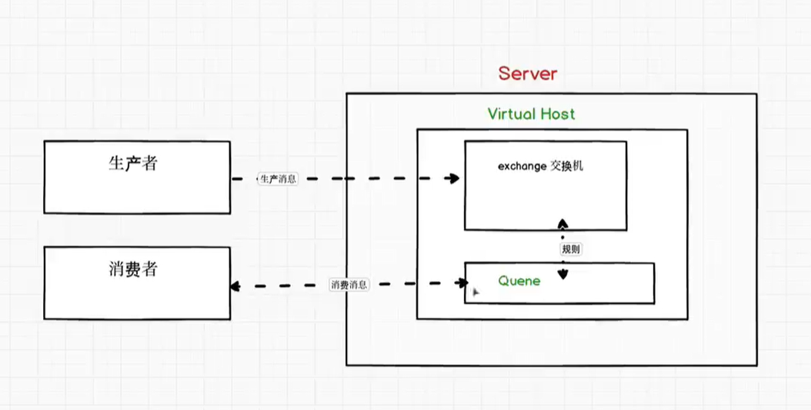

#1.linux启动RabbitMQ服务：
systemctl start rabbitmq-server
systemctl restart rabbitmq-server
systemctl stop rabbitmq-server

#2.访问rabbitmq web管理界面
首先需要关闭linux服务器的防火墙
rabbitmq的默认端口是15672，服务器ip地址是47.119.120.170
开启rabbitmq server后，在浏览器输入47.119.120.170:15672
username:guest
password:guest

##2.1 Centos7默认安装了firewalld，如果没有安装的话，可以使用 yum install firewalld firewalld-config进行安装。
1.启动防火墙
systemctl start firewalld

2.禁用防火墙
systemctl stop firewalld

3.设置开机启动
systemctl enable firewalld

4.停止并禁用开机启动
systemctl disable firewalld

5.重启防火墙

firewall-cmd --reload

6.查看状态
systemctl status firewalld或者 firewall-cmd --state

7.查看版本
firewall-cmd --version

8.查看帮助
firewall-cmd --help

#amqp协议

#3.虚拟主机
##Linux系统下，RabbitMQ虚拟主机配置
Kevin用户（pwd:123 ）,需要给新船舰的用户绑定一个虚拟主机

##windows系统下，RabbitMQ虚拟主机配置
1.需要用到工具 :rabbitmqctl

2.进入rabbitmqctl目录：C:\Program Files (x86)\RabbitMQ Server\rabbitmq_server-3.3.1\sbin

3.建立测试用户

rabbitmqctl  add_user test 123456 ，这样我们就新建了一个可以连到rabbitmq的用户，用户名时test,密码是123456

用 rabbitmqctl list_users 看看有多少个用户了,可以看到有guest和test了吧

4.rabbitmqctl add_vhost命令新建一个virtual host :   rabbitmqctl add_vhost test_host

通过 rabbitmqctl list_vhosts命令看看现在系统有几个vhost

5.我们只是声明了一个vhost，我们还要给它分配访问权限

rabbitmqctl set_permissions -p test_host  test "test-*" ".*" ".*"，如此用户名为test的用户就可以访问vitrual host为test_host的资源了，并且具备读写的权限。

6.可通过网页添加用户，exchange，queue，在queue下找到binding设置key。

7.federation插件，首先需要开启federation插件 ，进入2.的目录

rabbitmq - plugins enable rabbitmq_federation
rabbitmq-plugins enable rabbitmq_federation_management